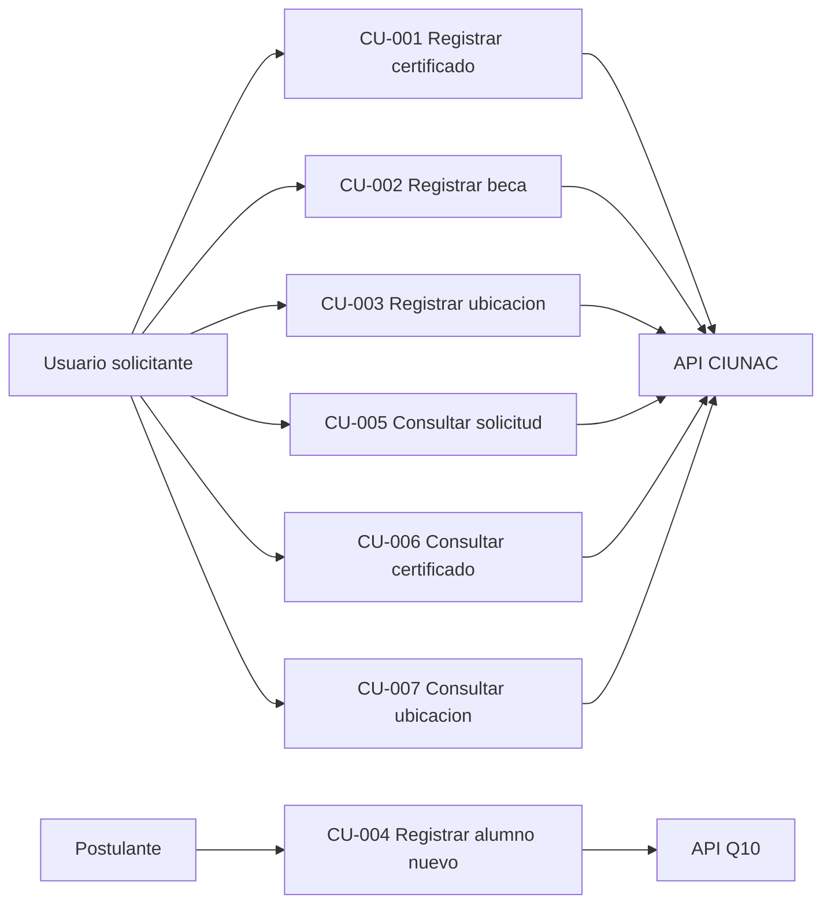
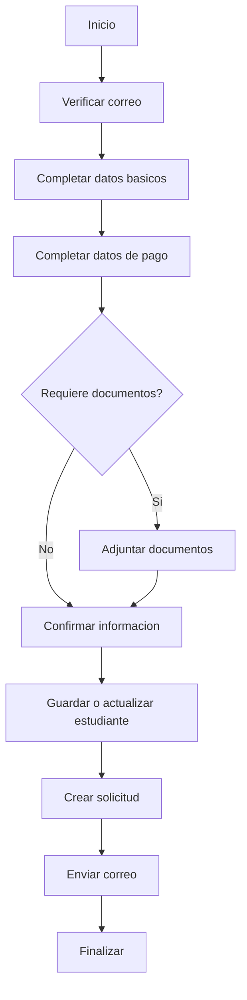
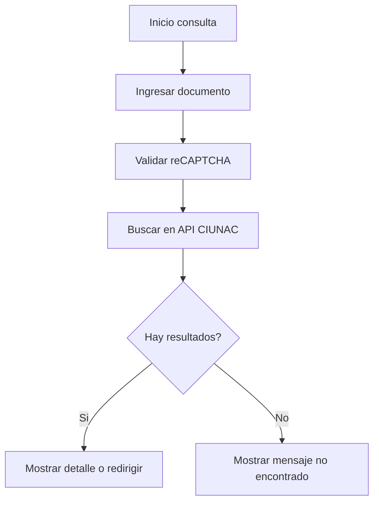

# Indice de Casos de Uso

## Objetivo
Este indice lista los casos de uso funcionales del frontend CIUNAC y su relacion con los actores principales. Los detalles de cada caso viven en documentos individuales dentro de esta carpeta.

## Casos de Uso
| ID | Caso de uso | Documento |
| --- | --- | --- |
| CU-001 | Registrar solicitud de certificado | [solicitud-certificado.md](./solicitud-certificado.md) |
| CU-002 | Registrar solicitud de beca | [solicitud-beca.md](./solicitud-beca.md) |
| CU-003 | Registrar solicitud de examen de ubicacion | [solicitud-ubicacion.md](./solicitud-ubicacion.md) |
| CU-004 | Registrar alumno nuevo | [solicitud-nuevo.md](./solicitud-nuevo.md) |
| CU-005 | Consultar solicitud por documento | [consulta-solicitud.md](./consulta-solicitud.md) |
| CU-006 | Consultar certificado | [consulta-certificado.md](./consulta-certificado.md) |
| CU-007 | Consultar ubicacion | [consulta-ubicacion.md](./consulta-ubicacion.md) |

## Diagrama General

## Flujo General de Solicitud

## Flujo General de Consulta

