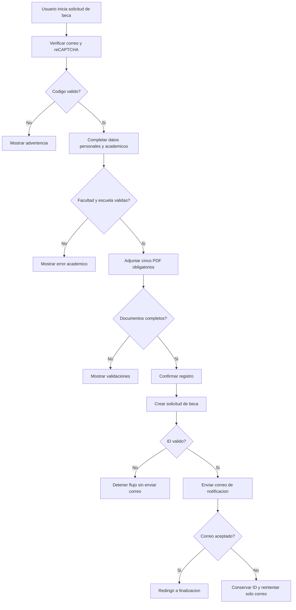

# CU-002 Registrar Solicitud de Beca

## Objetivo
Permitir que un Usuario solicitante registre una solicitud de beca con datos personales, academicos y documentos obligatorios.

## Actores
- Actor principal: Usuario solicitante.
- Actores secundarios: Sistema CIUNAC, API CIUNAC, Servicio de correo, Servicio de archivos.

## Precondiciones
- El usuario cuenta con correo electronico valido.
- El sistema puede consultar y validar facultades y escuelas desde servidor.
- El servicio de archivos esta disponible para adjuntos.

## Disparador
El usuario ingresa a `app/solicitud-beca/page.tsx`, valida correo y accede al proceso de beca.

## Flujo Principal
1. El sistema solicita correo y codigo de verificacion.
2. El usuario valida el correo.
3. El sistema redirige a `app/solicitud-beca/proceso/page.tsx`.
4. El sistema entrega facultades y escuelas validadas al formulario.
5. El usuario completa apellidos, nombres, facultad, escuela, direccion, codigo, tipo de documento, documento y celular.
6. El usuario adjunta constancia de matricula, historial academico, constancia de tercio, carta de compromiso y declaracion jurada en PDF.
7. El usuario confirma el registro.
8. El sistema valida el modelo completo y crea la solicitud de beca.
9. El sistema envia notificacion por correo.
10. El sistema redirige a la pantalla final con un identificador valido.

## Diagrama del Flujo


## Flujos Alternativos
- Si el usuario no completa un documento obligatorio, el sistema no permite avanzar.
- Si el documento tiene longitud invalida segun tipo, el sistema muestra validacion.
- Si cambia el numero de documento despues de cargar archivos, el sistema invalida los documentos anteriores.
- Si no se cargan facultades o escuelas, el sistema muestra indisponibilidad con opcion de reintento.

## Excepciones
- Si falla la creacion de solicitud de beca, el sistema muestra error.
- Si la API responde sin identificador, el sistema detiene el flujo y no envia correo.
- Si un PDF supera 8 MiB, tiene MIME, extension o firma incompatible, se rechaza antes de enviarlo al proveedor.
- Si falla el correo despues del guardado, el sistema conserva el ID y permite reintentar solo la notificacion.

## Postcondiciones
- La solicitud de beca queda registrada en API CIUNAC cuando el flujo termina exitosamente.
- Los documentos enviados quedan asociados a la solicitud segun respuesta del servicio de archivos.

## Datos Requeridos
- Correo electronico.
- Apellidos y nombres.
- Facultad y escuela.
- Direccion.
- Codigo.
- Tipo y numero de documento.
- Celular.
- Cinco documentos obligatorios de beca.
- Cada documento debe ser PDF y no superar 8 MiB.

## Reglas Relacionadas
- RF-001, RF-002, RF-010, RF-011, RF-018.
- RN-001, RN-002, RN-003, RN-006, RN-008.

## Criterios de Aceptacion
```gherkin
Dado que el usuario valido su correo
Y completo datos academicos y documentos obligatorios
Cuando confirma la solicitud de beca
Entonces el sistema registra la solicitud
Y envia notificacion por correo
Y no registra la misma solicitud nuevamente si solo se reintenta el correo
```

