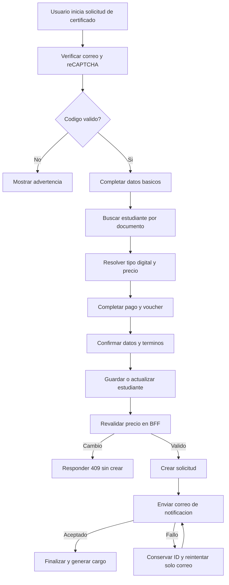

# CU-001 Registrar Solicitud de Certificado

## Objetivo
Permitir que un Usuario solicitante registre una solicitud de certificado CIUNAC, completando verificacion de correo, datos basicos, pago, confirmacion y descarga de cargo.

## Actores
- Actor principal: Usuario solicitante.
- Actores secundarios: Sistema CIUNAC, API CIUNAC, Servicio de correo, Servicio de archivos.

## Precondiciones
- El usuario cuenta con correo electronico valido.
- Los catalogos de tipos de solicitud, idioma, facultad, escuela y textos pueden consultarse desde API CIUNAC.
- reCAPTCHA esta disponible en el navegador.

## Disparador
El usuario ingresa a `app/solicitud-certificados/page.tsx` e inicia la verificacion de correo.

## Flujo Principal
1. El sistema muestra el formulario de verificacion de correo.
2. El usuario ingresa correo, solicita codigo y resuelve reCAPTCHA.
3. El servidor valida el OTP temporal de 6 digitos.
4. El sistema redirige a `app/solicitud-certificados/proceso/page.tsx`.
5. El usuario completa tipo de solicitud, idioma, nivel, datos personales y datos academicos si declara ser alumno.
6. El sistema permite buscar datos de estudiante por documento y precargar datos si existen.
7. El sistema deriva si el certificado es digital y muestra el precio normal vigente del catalogo.
8. El usuario registra numero, fecha y voucher cuando el monto es mayor que cero.
9. El usuario confirma que la informacion es correcta y acepta terminos.
10. El sistema guarda o actualiza estudiante.
11. El BFF revalida que el monto coincida con el precio vigente.
12. El sistema crea la solicitud y exige un identificador valido.
13. El sistema solicita la notificacion por correo.
14. El sistema redirige a finalizacion y permite generar el cargo PDF.

## Diagrama del Flujo


## Flujos Alternativos
- Si el codigo de correo es incorrecto, el sistema muestra advertencia y no avanza.
- Si el usuario no resuelve reCAPTCHA, el sistema muestra advertencia y no avanza.
- Si no se encuentran datos por documento, el usuario puede ingresar datos manualmente.
- Si el monto vigente es cero, el flujo permite continuar sin voucher.
- Si el estudiante existe, el sistema actualiza sus datos mediante su identificador.
- Si el correo falla despues del guardado, el usuario puede reintentar solo la notificacion.

## Excepciones
- Si falla guardar estudiante, el sistema muestra error de procesamiento.
- Si falla crear solicitud, el sistema muestra error y no finaliza el flujo.
- Si el precio cambia o es manipulado, el BFF responde `409` y no crea la solicitud.
- Si la API no devuelve un identificador valido, el sistema no envia correo ni navega.
- Si falla el envio de correo despues de crear solicitud, el sistema informa exito parcial y conserva el ID.

## Postcondiciones
- La solicitud queda creada en API CIUNAC cuando el flujo finaliza exitosamente.
- El usuario queda en la pantalla de finalizacion.
- El estado temporal del flujo queda preparado para reiniciarse al iniciar un nuevo proceso.

## Datos Requeridos
- Correo electronico.
- Tipo de solicitud.
- Apellidos y nombres.
- Idioma y nivel.
- Tipo y numero de documento.
- Celular.
- Datos academicos si el usuario declara ser alumno.
- Datos de pago cuando corresponde.
- Voucher cuando el monto es mayor que cero.

## Reglas Relacionadas
- RF-001, RF-002, RF-003, RF-004, RF-005, RF-006, RF-007, RF-008, RF-009, RF-010, RF-018.
- RN-001, RN-002, RN-003, RN-004, RN-005, RN-008, RN-010, RN-015, RN-016, RN-017.

## Criterios de Aceptacion
```gherkin
Dado que el usuario valido su correo
Y completo los datos obligatorios del certificado
Cuando confirma la solicitud
Entonces el sistema registra estudiante y solicitud
Y redirige a la pantalla de finalizacion
```

```gherkin
Dado que el usuario selecciona un pago distinto de cero
Cuando intenta avanzar sin numero de voucher o fecha de pago
Entonces el sistema muestra validacion de campo requerido
```

```gherkin
Dado que el navegador envia un monto distinto del tarifario vigente
Cuando el BFF valida la solicitud
Entonces responde PRICE_CHANGED
Y no reenvia la creacion a la API CIUNAC
```

```gherkin
Dado que la solicitud fue creada y el correo fallo
Cuando el usuario reintenta la notificacion
Entonces el sistema no vuelve a guardar estudiante ni solicitud
Y reintenta exclusivamente el correo
```

