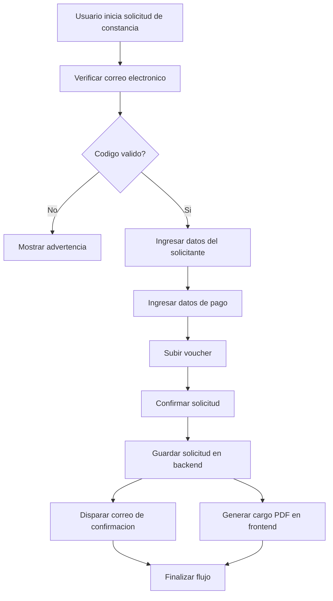

# CU-008 Registrar Solicitud de Constancia

## Objetivo
Permitir que un Usuario solicitante registre una solicitud de constancia en un flujo independiente al de certificados, completando verificacion de correo, datos del solicitante, datos de pago, voucher, registro backend, correo de confirmacion y descarga de cargo PDF generado en frontend.

## Actores
- Actor principal: Usuario solicitante.
- Actores secundarios: Sistema CIUNAC, API CIUNAC, Servicio de correo, Servicio de archivos.

## Precondiciones
- El usuario cuenta con correo electronico valido.
- El servicio de correo permite enviar codigo de verificacion y confirmacion.
- El backend expone un mecanismo para guardar la solicitud de constancia.
- El frontend puede generar el cargo PDF con `@react-pdf/renderer`.
- Pendiente de validacion funcional: confirmar si constancias usa el endpoint actual `solicitudes` o un endpoint nuevo.

## Disparador
El usuario ingresa al futuro flujo `app/solicitud-constancias/page.tsx` e inicia la verificacion de correo.

## Flujo Principal
1. El sistema muestra el formulario de verificacion de correo.
2. El usuario ingresa correo, solicita codigo y resuelve reCAPTCHA.
3. El sistema valida el codigo temporal.
4. El sistema redirige al proceso de solicitud de constancia.
5. El usuario ingresa datos personales y academicos requeridos.
6. El usuario ingresa datos de pago.
7. El usuario sube el voucher de pago.
8. El usuario confirma que la informacion es correcta.
9. El frontend envia la solicitud al backend.
10. El backend guarda la solicitud y retorna un identificador.
11. El frontend solicita al BFF el correo de confirmacion y el BFF invoca el servicio externo.
12. El frontend genera el cargo PDF con los datos de la solicitud.
13. El sistema permite descargar el cargo PDF.
14. El sistema muestra la finalizacion del flujo.

## Diagrama del Flujo


## Flujos Alternativos
- Si el codigo de correo es incorrecto, el sistema muestra advertencia y no permite iniciar el proceso.
- Si el usuario no resuelve reCAPTCHA, el sistema muestra advertencia y no continua.
- Si el voucher no fue subido, el sistema muestra validacion y no registra la solicitud.
- Si el backend no retorna identificador, el sistema muestra error y no genera cargo final.

## Excepciones
- Si falla el guardado en backend, el sistema debe mostrar un error comprensible y conservar al usuario en el flujo.
- Si falla el correo de confirmacion, el sistema debe mostrar error de integracion o registrar el problema segun el patron acordado.
- Si falla la generacion de PDF en frontend, el sistema debe permitir reintentar la descarga del cargo.

## Postcondiciones
- La solicitud queda registrada en backend cuando el flujo termina exitosamente.
- El usuario puede descargar un cargo PDF generado en frontend.
- El correo de confirmacion fue solicitado por frontend y enviado server-side por el BFF.

## Datos Requeridos
- Correo electronico.
- Tipo de constancia.
- Apellidos y nombres.
- Tipo y numero de documento.
- Celular.
- Datos academicos requeridos.
- Pago.
- Numero de voucher.
- Fecha de pago.
- Imagen o archivo del voucher.

## Reglas Relacionadas
- RF-001, RF-002, RF-007, RF-010, RF-018, RF-019, RF-020.
- RN-001, RN-002, RN-003, RN-005, RN-008, RN-011, RN-012.

## Criterios de Aceptacion
```gherkin
Dado que el usuario valido su correo
Cuando completa datos, pago y voucher
Entonces el sistema permite confirmar la solicitud de constancia
```

```gherkin
Dado que el usuario confirma una solicitud valida
Cuando el backend guarda la solicitud
Entonces el frontend solicita al BFF el correo de confirmacion
Y genera el cargo PDF en frontend
```

```gherkin
Dado que falta el voucher de pago
Cuando el usuario intenta finalizar
Entonces el sistema muestra validacion
Y no envia la solicitud al backend
```

```gherkin
Dado que la solicitud fue registrada correctamente
Cuando el usuario llega a finalizar
Entonces puede descargar el cargo PDF
```

