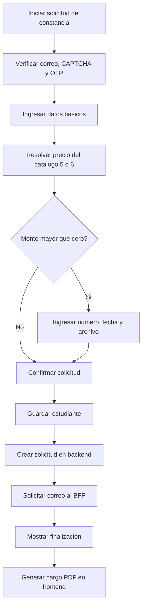

# CU-008 Registrar Solicitud de Constancia

## Objetivo
Permitir que un Usuario solicitante registre una constancia en un flujo independiente de certificados, con verificacion de correo, datos personales y academicos, pago compartido, persistencia, notificacion y cargo PDF generado en frontend.

## Actores
- Actor principal: Usuario solicitante.
- Actores secundarios: Sistema CIUNAC, API CIUNAC, Servicio de correo y Servicio de archivos.

## Precondiciones
- El usuario cuenta con un correo electronico valido.
- La API expone los tipos de solicitud `5` y `6` y sus precios.
- El usuario obtiene una sesion verificada para el proposito `CONSTANCIA`.

## Disparador
El usuario ingresa a `app/solicitud-constancias/page.tsx` e inicia la verificacion de correo.

## Flujo Principal
1. El usuario solicita y valida un OTP despues de resolver CAPTCHA.
2. El sistema abre el wizard de constancias con la sesion verificada.
3. El usuario selecciona tipo de constancia, idioma y nivel e ingresa sus datos.
4. Si declara ser Alumno UNAC, ingresa facultad, escuela y codigo.
5. El flujo resuelve el precio del tipo seleccionado y lo inyecta al componente compartido de pago.
6. Si el monto es mayor que cero, el usuario ingresa numero de 15 digitos, fecha y archivo del voucher.
7. El usuario revisa y confirma la solicitud.
8. El caso de uso guarda o actualiza al estudiante y crea la solicitud en `solicitudes`.
9. El frontend solicita al BFF la notificacion `CONSTANCIA` usando el ID persistido.
10. El sistema redirige a finalizar con el ID y el comprobante de notificacion.
11. El frontend consulta la solicitud y genera un cargo PDF A4 descargable.

## Diagrama del Flujo


## Flujos Alternativos
- Si el OTP o CAPTCHA no es valido, no se crea la sesion del proceso.
- Si el monto es cero, los campos de voucher permanecen deshabilitados y el usuario puede continuar.
- Si el correo falla despues de guardar, se conserva el ID y se permite reintentar solo la notificacion.
- Si el PDF no puede generarse, la solicitud permanece guardada y la descarga se puede reintentar.

## Excepciones
- Una respuesta de estudiante sin ID detiene la creacion de la solicitud.
- Una respuesta de solicitud sin ID detiene correo, navegacion y PDF final.
- Un error de carga impide completar un pago mayor que cero.
- Un acceso directo al proceso sin sesion `CONSTANCIA` redirige a la portada del flujo.

## Postcondiciones
- La solicitud queda registrada en el endpoint `solicitudes` con tipo `5` o `6`.
- El usuario obtiene un cargo PDF generado en frontend.
- La pagina final solo confirma el correo si existe un comprobante server-side valido.

## Datos Requeridos
- Correo, tipo de constancia, idioma y nivel.
- Apellidos, nombres, tipo y numero de documento y celular.
- Facultad, escuela y codigo solo cuando se declara Alumno UNAC.
- Monto y, si es mayor que cero, numero, fecha y archivo del voucher.

## Reglas Relacionadas
- RF-001, RF-002, RF-007, RF-009, RF-010, RF-018, RF-019 y RF-020.
- RN-001, RN-002, RN-003, RN-005, RN-008, RN-011, RN-012, RN-013 y RN-014.

## Criterios de Aceptacion
```gherkin
Dado un monto mayor que cero
Cuando falta el numero, fecha o archivo del voucher
Entonces el sistema no permite avanzar al registro
```

```gherkin
Dado un monto igual a cero
Cuando el usuario no adjunta voucher
Entonces el sistema permite continuar
```

```gherkin
Dado que la solicitud fue guardada y el correo fallo
Cuando el usuario reintenta la notificacion
Entonces el sistema no vuelve a guardar estudiante ni solicitud
```

```gherkin
Dado que el registro y la notificacion fueron aceptados
Cuando el usuario llega a finalizar
Entonces puede descargar el cargo PDF generado en frontend
```
