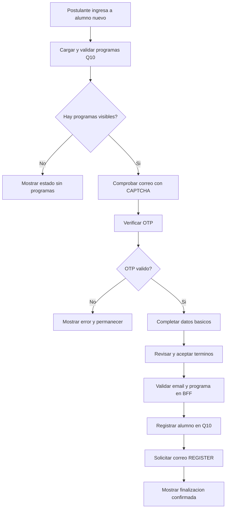

# CU-004 Registrar Alumno Nuevo

## Objetivo

Permitir que un postulante verifique su correo, seleccione un programa vigente y
registre sus datos como alumno nuevo mediante la integracion Q10.

## Actores

- Actor principal: Postulante.
- Actores secundarios: Sistema CIUNAC, API Q10 y Servicio de correo.

## Precondiciones

- API Q10 debe proporcionar al menos un programa visible.
- El postulante debe disponer de un correo electronico valido.
- OTP, CAPTCHA y servicio de correo deben estar disponibles.

## Flujo Principal

1. El sistema consulta y valida programas desde API Q10.
2. El postulante ingresa su correo, confirma el CAPTCHA y solicita un OTP.
3. El postulante verifica el codigo de seis digitos.
4. El postulante completa identidad, nacimiento, contacto y programa.
5. El sistema valida DNI o CE, telefono, fecha y pertenencia del programa al catalogo.
6. El postulante revisa la informacion y acepta los terminos.
7. El BFF confirma que el email coincide con la sesion y que el programa sigue vigente.
8. El sistema registra el alumno en Q10.
9. El sistema solicita el correo de registro usando el documento como referencia.
10. El sistema emite un comprobante y muestra la finalizacion confirmada.



## Flujos Alternativos

- Un catalogo Q10 vacio muestra un estado funcional sin iniciar el wizard.
- Un catalogo mal formado o indisponible activa el estado de error con reintento.
- Un OTP incorrecto, expirado o reutilizado no permite avanzar.
- Un DNI, CE, telefono o fecha invalida mantiene al usuario en datos basicos.
- Un programa retirado antes del submit es rechazado por el BFF.
- Q10 puede confirmar el registro con `204` o un objeto JSON valido.
- Si falla el correo despues del registro, se conserva el documento y solo se reintenta la notificacion.

## Excepciones

- Una respuesta Q10 mal formada detiene el correo y bloquea un reenvio automatico.
- Un error de red durante el registro se considera escritura indeterminada para evitar duplicados.
- Sin comprobante valido, la pagina final no afirma que el alumno fue registrado.

## Postcondiciones

- Exito completo: Q10 acepta el registro y el mailer acepta la notificacion.
- Exito parcial: Q10 acepta el registro y el correo queda pendiente de reintento.
- Fallo: no se ejecutan operaciones posteriores cuando el registro no fue confirmado.

## Datos Requeridos

- Correo electronico verificado.
- Primer y segundo apellido.
- Primer nombre y segundo nombre opcional.
- Fecha de nacimiento no futura.
- Genero.
- DNI de 8 digitos o CE de 9 caracteres alfanumericos.
- Telefono de 9 digitos.
- Programa Q10 vigente.

## Reglas Relacionadas

- RF-001, RF-002, RF-014 y RF-018.
- RN-001, RN-002, RN-003, RN-008, RN-019, RN-020 y RN-021.

## Criterios de Aceptacion

```gherkin
Dado un correo verificado y un programa vigente
Y datos personales validos
Cuando el postulante confirma el registro
Entonces el BFF valida email y programa
Y Q10 recibe un unico registro
Y la finalizacion solo confirma el exito con un comprobante valido
```
