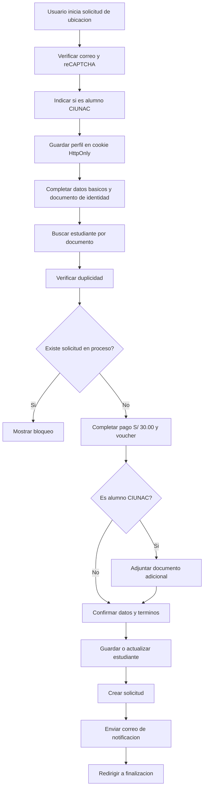
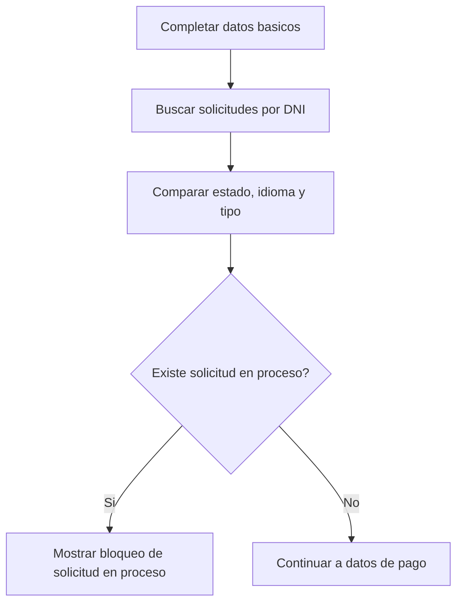

# CU-003 Registrar Solicitud de Examen de Ubicacion

## Objetivo
Permitir que un Usuario solicitante registre una solicitud de examen de ubicacion, verificando correo, datos personales, pago, documentos si aplica y duplicidad de solicitud en proceso.

## Actores
- Actor principal: Usuario solicitante.
- Actores secundarios: Alumno UNAC/CIUNAC, Sistema CIUNAC, API CIUNAC, Servicio de correo, Servicio de archivos.

## Precondiciones
- El usuario cuenta con correo electronico valido.
- El sistema puede consultar cronogramas y catalogos necesarios.
- El sistema puede consultar solicitudes existentes por documento.

## Disparador
El usuario ingresa a `app/solicitud-ubicacion/page.tsx`, valida correo e indica si es alumno CIUNAC.

## Flujo Principal
1. El sistema muestra verificacion de correo y informacion de cronogramas.
2. El usuario valida el correo.
3. El sistema pregunta si el usuario es alumno CIUNAC y guarda el perfil en una sesion server-side.
4. El sistema redirige a `app/solicitud-ubicacion/proceso/page.tsx`.
5. El usuario completa datos basicos, documento, idioma, nivel, celular y adjunto de DNI.
6. El sistema permite buscar estudiante por documento y precargar datos si existen.
7. El sistema consulta solicitudes existentes por documento.
8. El sistema valida si existe una solicitud en proceso con mismo documento, idioma y tipo de solicitud.
9. Si no hay duplicidad, el usuario completa el pago de S/ 30.00 y el voucher.
10. Si el usuario es alumno CIUNAC, el sistema solicita un certificado de estudios PDF y permite seleccionar nivel; si no lo es, usa nivel basico.
11. El usuario confirma datos y acepta terminos.
12. El sistema guarda o actualiza estudiante.
13. El BFF revalida perfil, tarifa S/ 30.00 y duplicidad, y crea la solicitud de ubicacion.
14. El sistema envia notificacion por correo.
15. El sistema redirige a la pantalla final.

## Diagrama del Flujo


## Flujo Especifico de Duplicidad


## Flujos Alternativos
- Si el usuario no es alumno CIUNAC, el flujo omite el certificado academico y usa nivel basico.
- Si no existe estudiante por documento, el usuario completa datos manualmente.
- Si hay solicitud en proceso, el sistema muestra dialogo de bloqueo y no avanza.

## Excepciones
- Si falla la consulta de duplicidad, el sistema debe informar error de verificacion.
- Si el tarifario no contiene S/ 30.00, el sistema bloquea el flujo por inconsistencia de configuracion.
- Si falla guardar estudiante o crear solicitud, el sistema detiene el flujo.
- Si la solicitud se guarda y falla el correo, el sistema conserva el ID y permite reintentar solo la notificacion.

## Postcondiciones
- La solicitud queda creada cuando no hay duplicidad y las integraciones responden correctamente.
- Si hay duplicidad, no se crea una nueva solicitud desde el frontend.

## Datos Requeridos
- Correo electronico.
- Indicador de alumno CIUNAC.
- Tipo de solicitud.
- Apellidos y nombres.
- Idioma y nivel.
- Tipo y numero de documento.
- Celular.
- Documento de identidad en PDF, PNG o JPEG.
- Pago, voucher y fecha cuando corresponde.
- Certificado de estudios PDF cuando el perfil es CIUNAC.

## Reglas Relacionadas
- RF-001, RF-002, RF-005, RF-007, RF-008, RF-009, RF-010, RF-012, RF-013, RF-018, RF-021, RF-022, RF-023.
- RN-001, RN-002, RN-003, RN-005, RN-007, RN-008, RN-009, RN-010, RN-022, RN-023, RN-024, RN-025, RN-026.

## Criterios de Aceptacion
```gherkin
Dado que no existe solicitud en proceso para el documento, idioma y tipo
Cuando el usuario completa y confirma el flujo
Entonces el sistema registra la solicitud de ubicacion
Y envia la notificacion por correo
```

```gherkin
Dado que el tarifario externo del tipo 7 no es S/ 30.00
Cuando el usuario intenta iniciar o registrar la solicitud
Entonces el sistema bloquea la operacion
Y no envia una solicitud al backend
```

```gherkin
Dado que existe una solicitud en proceso para el mismo documento, idioma y tipo
Cuando el usuario intenta continuar desde datos basicos
Entonces el sistema muestra bloqueo
Y no avanza a datos de pago
```

