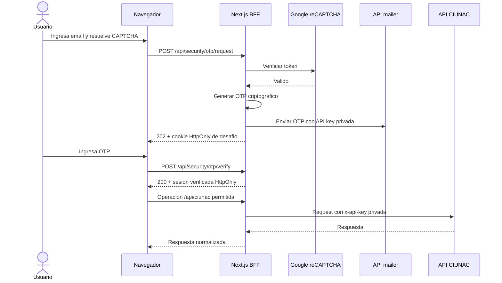

# Fase 1C: Seguridad de API, OTP y CAPTCHA

## Alcance Implementado
- BFF en `/api/ciunac/[...path]` con allowlist de rutas y metodos.
- Endpoints dedicados para OTP, consulta CAPTCHA y notificaciones.
- API key CIUNAC inyectada unicamente en servidor.
- OTP criptografico de seis digitos y cookies cifradas.
- CAPTCHA verificado contra Google desde servidor.
- Sesion verificada requerida para procesos, mutaciones, uploads y correo transaccional.
- Sesion de consulta requerida para resultados por documento.
- Logs server-side con evento, correlation ID, estado y codigo, sin datos personales.

## Flujo


## Variables
| Variable | Visibilidad | Uso |
| --- | --- | --- |
| `API_URL` | Privada | URL de API CIUNAC. |
| `API_KEY` | Privada | Credencial enviada por el BFF a CIUNAC. |
| `API_KEY_Q10` | Privada | Credencial de consulta Q10 server-side. |
| `APP_BASE_URL` | Privada | Origen permitido para requests mutables. |
| `RECAPTCHA_SECRET_KEY` | Privada | Verificacion server-side con Google. |
| `OTP_SESSION_SECRET` | Privada | Cifrado y HMAC; minimo 32 bytes. |
| `NEXT_PUBLIC_RECAPTCHA_SITE_KEY` | Publica | Render del widget CAPTCHA. |

`.env.example` documenta los nombres, pero no es cargado como configuracion real. Desarrollo usa `.env`; produccion usa el gestor de secretos del hosting.

## Comandos
```bash
npm run env:check
npm run test:unit
npm run test:e2e
npm run build
npm run security:bundle-check
```

`env:check` nunca muestra valores. `security:bundle-check` compara valores privados configurados contra `.next/static` sin imprimirlos.

## Operacion Manual Obligatoria
1. Rotar la API key CIUNAC expuesta anteriormente.
2. Configurar la nueva clave como `API_KEY` en el hosting.
3. Configurar `RECAPTCHA_SECRET_KEY`, `OTP_SESSION_SECRET`, `API_URL` y `APP_BASE_URL`.
4. Desplegar y verificar el BFF.
5. Revocar la clave anterior.
6. Eliminar `NEXT_PUBLIC_API_KEY` del entorno y reconstruir.

La fase no esta lista para produccion mientras `npm run env:check` reporte variables ausentes, invalidas o deprecadas.
